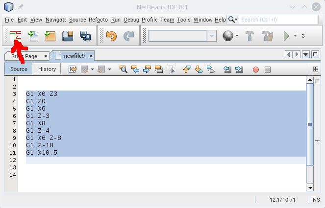
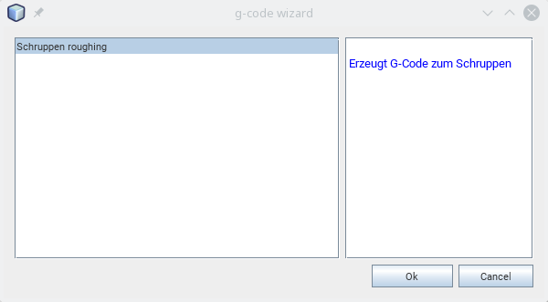
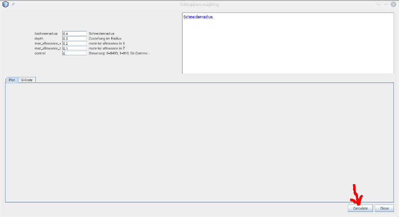
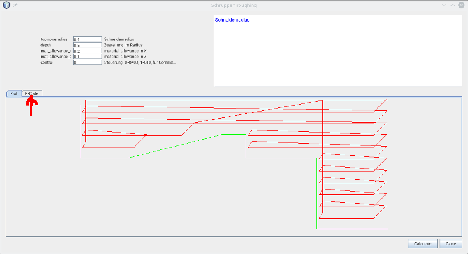
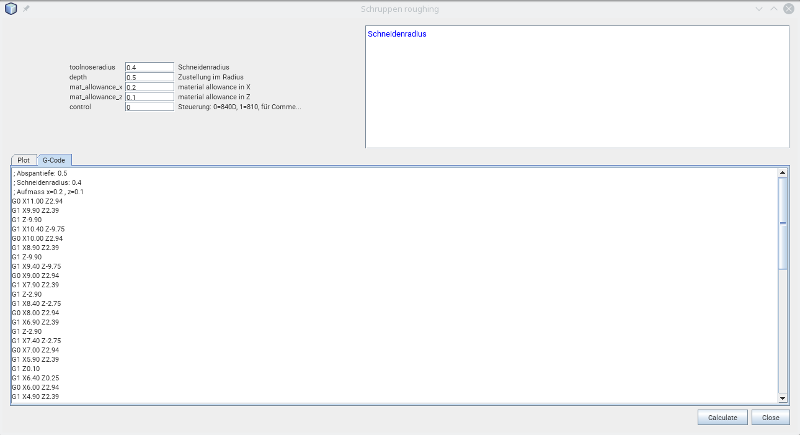

# GCodeGenerator

Allows to create G-code for roughing for Sinumerik 810 and 840D. Only for lathe.

# Installation

* at the moment not to download from netbeans repository, you can download it from github, open in netbeans and right mouse button on the Project and "Create NBM" to compile it.
The compiled file ".nbm" is in Project folder in the "build" directory.
* Go to "Tools" -> "Plugins" -> "Downloaded", click "Add Plugins..." and select the downloaded file org-roiderh-gcodefunctions.nbm
* Check the Checkbox and click "Install"

# Usage

Select a pice of g-code which describes a contour. Click the Toolbar button.

Select the generator (for the moment only roughing) and click "Ok"

Edit the parameters for roughing and click "Calculate"

The created toolpath. The green line is the contour from the selected g-code, the red line is the generated toolpath for roughing. Click on "G-Code" to show the generated g-code.

The g-code for roughing. Select this code and copy it with <kbd>strg</kbd>+<kbd>C</kbd>  and paste it with <kbd>strg</kbd>+<kbd>V</kbd> where ever you want.

