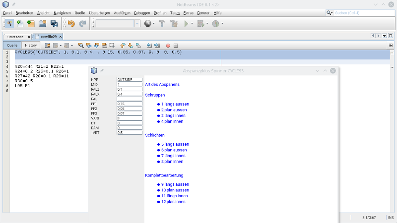

# GCodeFunctions

Allows to create or edit G-code to call cycles for Sinumerik 810 and 840D. The File with the description of the parameters is hardcoded: GCodeFunctions/src/resources/cycles.json
and in the german language. Only a few cycles are defined for lathe.

# Installation

* Download from: http://plugins.netbeans.org/plugin/63430/gcodefunctions
* Go to "Tools" -> "Plugins" -> "Downloaded", click "Add Plugins..." and select the downloaded file org-roiderh-gcodefunctions.nbm
* Check the Checkbox and click "Install"

# Usage

Move the cursor to a empty line and click the toolbar button: 
A list with all cycles in the file: src/resources/cycles.json appears. Select a cycle and click "ok". After that another window appear to edit the values.

It is possible to select the pice of G-code with the cycle call and click the button:  
to edit the values.

A screenshot:

